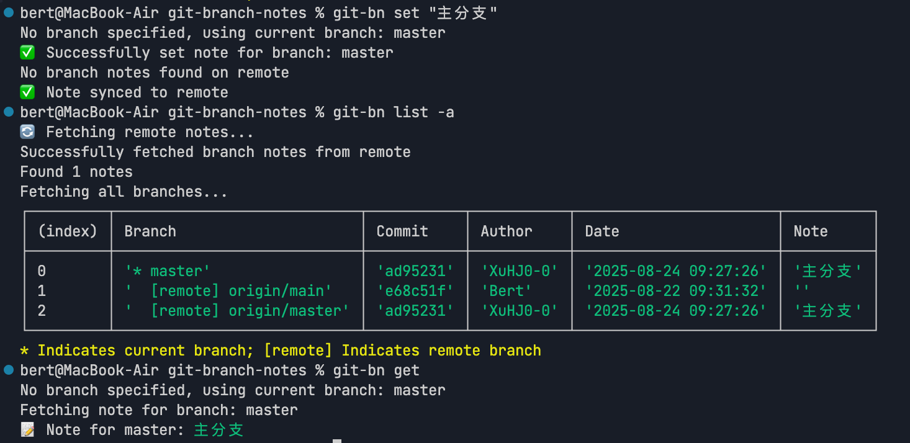

# Git Branch Notes（Git 分支备注工具）
**其他语言: [English](README.md).**

欢迎使用 Git Branch Notes！这是一个用于管理 Git 分支备注的命令行工具，采用基于文件的存储方式。

[npm包仓库地址](https://www.npmjs.com/package/git-branch-notes)

[](LICENSE)


## 安装方式 

```bash
npm install -g git-branch-notes
```

## 备注存储机制

Git Branch Notes 采用基于文件的存储系统。分支备注存储在仓库根目录下的 `branch-notes.json` 文件中。这种方式确保备注始终与分支名称相关联，而不是与提交哈希关联，即使分支更新了新的提交，备注也能保持持久性。

由于文件存储在项目根目录（而不是 .git/ 目录中），您可以通过 Git 提交和推送轻松与团队成员共享。这使得团队成员之间可以无缝协作管理分支备注。

文件结构如下：

```json
{
  "version": "1.0.0",
  "notes": [
    {
      "branchName": "main",
      "note": "这是主分支",
      "timestamp": "2023-09-15T12:34:56.789Z"
    }
  ],
  "lastUpdated": "2023-09-15T12:34:56.789Z"
}
```

## 使用方法
### 初始化所有分支，为所有分支创建空备注
```bash
git-bn init
```

### 列出所有分支及其备注（包括本地和远程分支）
```bash
git-bn list
git-bn list -a ## 显示所有分支，包括没有备注的分支 --all参数
```
### 只列出远程有备注的分支
```bash
git-bn list -r
git-bn list --remote
```
### 只列出本地有备注的分支
```bash
git-bn list -l
git-bn list --local
```
# 设置分支备注
```bash
git-bn set "正在开发新功能" ## 为当前分支设置备注
git-bn set -b feature-branch "正在开发新功能"
git-bn set --branch feature-branch "正在开发新功能"
```
如果设置备注时没有指定分支名称，默认会为当前所在分支设置备注。

### 查看分支备注映射（显示所有分支备注及其时间戳）
```bash
git-bn mapping
```

### 将备注文件推送到远程仓库
```bash
git-bn push
git-bn push -m "更新分支备注" ## 使用自定义提交信息推送
```

### 从远程仓库拉取备注文件
```bash
git-bn pull
```

### 同步命令（为保持向后兼容性保留，实际上文件存储不需要同步操作）
```bash
git-bn sync
```
### 获取特定分支的备注
```bash
git-bn get ## 获取当前分支的备注
git-bn get main
```

## 功能特点

+ 📝 为 Git 分支添加备注信息
+ 🔄 跨多个仓库同步备注（手动控制）
+ 🌐 支持远程同步功能
+ 🎯 简单直观的命令行界面

## 示例

